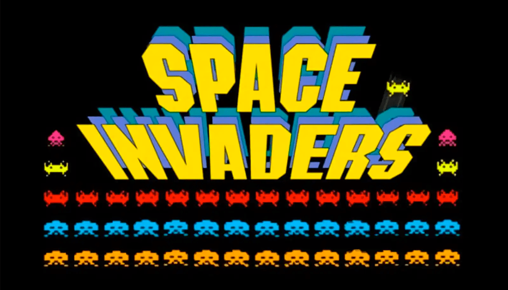

# The Space Invaders Retro Game - PYTHON VERSION
That is a learning project! What that means? I'm using this project or goal to learning something new, that is PYTHON!

## Overview about the Space Invaders
"Space Invaders" is a classic arcade game developed by Tomohiro Nishikado and released by Taito in 1978. It is one of the earliest and most influential video games, helping to establish the shoot 'em up genre and inspiring countless other games and media.

## Legacy
Space Invaders was a massive success in arcades around the world and became one of the highest-grossing arcade games of all time. Its simple yet compelling gameplay, along with its iconic alien designs and sound effects, cemented its place in gaming history. Space Invaders has been ported to numerous platforms and inspired countless sequels, spin-offs, and adaptations across various media.

## Cultural Impact
Space Invaders is credited with popularizing video games and helping to establish them as a mainstream form of entertainment. It also played a significant role in the rise of the arcade industry in the late 1970s and early 1980s. The game's imagery and references have become ingrained in popular culture, appearing in movies, television shows, music, and more.

Overall, Space Invaders remains a beloved classic that continues to be enjoyed by gamers of all ages, even decades after its initial release. Its simple yet addictive gameplay and iconic design ensure that it will be remembered as one of the most important and influential games of all time.
